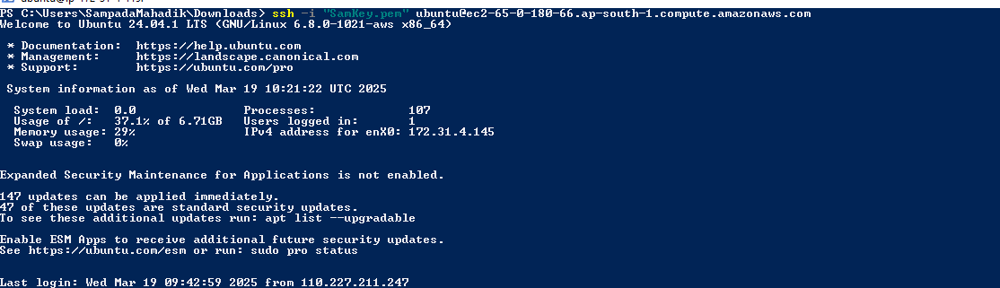
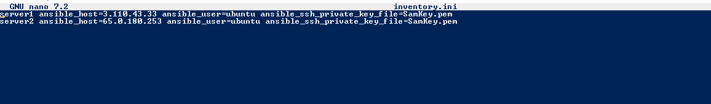
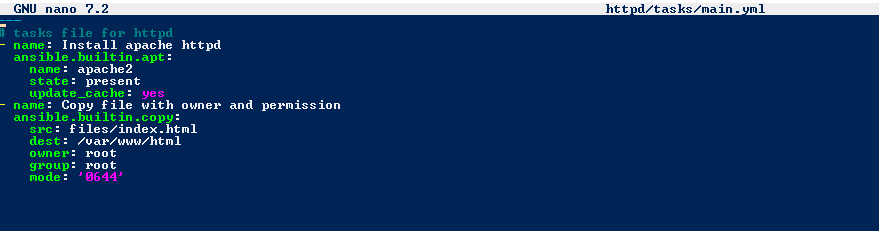
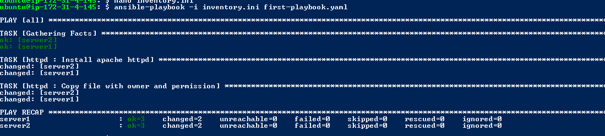
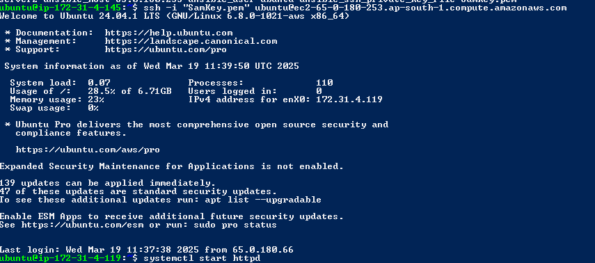
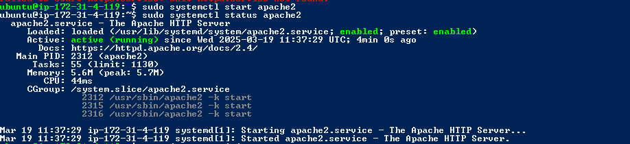
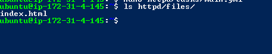
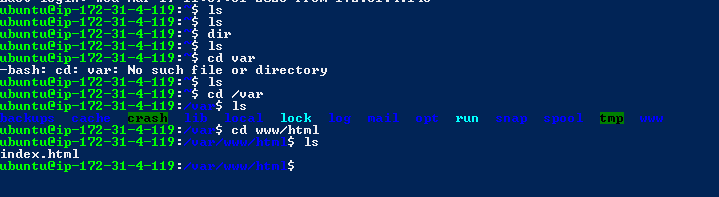
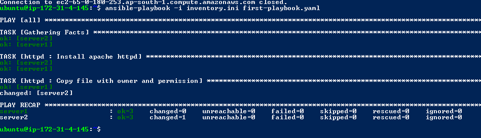

# Ansible Study and Hands-On

This repository contains commands and screenshots demonstrating how to use **Ansible** for automation tasks.

## Table of Contents
- [Introduction](#introduction)
- [Basic Commands](#basic-commands)
- [Common Ansible Modules](#common-ansible-modules)
- [Screenshots of Hands-On Practice](#screenshots-of-hands-on-practice-with-explination)

## Introduction
Ansible is a powerful automation tool for configuration management and deployment. In this repository, I share my commands and hands-on experiences with Ansible.

## Basic Commands
- `ansible --version`: Check Ansible version
- `ansible all -m ping`: Ping all hosts

- Ansible Galaxy:
Install a role: ansible-galaxy install <role_name>
Search for roles: ansible-galaxy search <role_name>
Create a new role: ansible-galaxy init <role_name>

- Ansible Inventory:
Specify an inventory file for a playbook: ansible-playbook -i inventory.ini playbook.yml
Ping all hosts in an inventory: ansible all -i inventory.ini -m ping

- Ansible Playbooks:
Run a playbook: ansible-playbook playbook.yml
Run a playbook with tags: ansible-playbook playbook.yml --tags <tag_name>
Check playbook syntax: ansible-playbook --syntax-check playbook.yml

## Common Ansible Modules
- `ping`: Tests connectivity.
- `command`: Runs commands on remote machines.

## Screenshots of Hands-On Practice
- Add your images in the `images/` folder.
1.First we SSH in tnto our EC2 server.
- 
2.create the first Yaml book by: nano/vim <File-name> (now we will use roles thats why we are not writing whole playbook in it #role is missing role:httpd or <rolename>)
- 
3.create role via ansible-galaxy role init <role-name>
- 
4.create inventory.ini file via vim/nano inventory.ini and write servers you created on aws (i created) this are my server in image. cat inventory.ini to see the servers.
- 
5.add tasks in the main file of the role in the subfolder task
- 
6.task file :
- 
7.Run the playbook
- 
8.ssh into the managed nodes means another servers to see are there playbook worked and install httpd.
- 
- 
9.i make the index.html file and mv it to the httpd files folder you can see. it is important to mv files you are using for reuse.
- 
- 
- 
- 
10.now we will delete the imdex.html file from one manged node and check is it worked and rectreate or not. and it worked.
- 
- 
